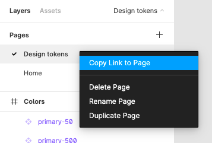

# Design Tokens


## UI Tokens Kit (figma page)

1. Crie seu arquivo no Figma

1. Adicione uma página para os `tokens`
   Recomendo usar o nome *Design tokens* ou *Tokens* por convenção / facilidade de identificação por outras pessoas.

1. Adicione *frames* para dividir seus tipos de tokens
   Exemplo: Colors, Typography, Shadows, etc...

1. Converta os elementos de seus tokens para componentes

---
## Configurando
No diretório `libs/design/tokens`

1. Remova o example no sufixo, assim: `.env.figma`

1. Você também precisa de um access token, [crie por aqui](https://www.figma.com/developers/api#access-tokens).

1. Adicione seu `access token` em `FIGMA_APIKEY`

1. Copie o link da página clicando com o botão direito sobre ela 

1. Adicione o `id` do link da página em `FIGMA_FILEID`


> ### Critérios
> Os tokens são capturados apenas de elementos convertidos para componentes, não esqueça de converte-los.


---

## FIGMA API

[Figma Developers API](https://www.figma.com/developers/api)


##### `libs/design/tokens/.env.figma`
```sh
# seu access token da api
FIGMA_APIKEY=seu_access_token
# id do arquivo no figma
FIGMA_FILEID=id_do_arquivo
# em branco para desligado
FIGMA_DEBUG=true
```
